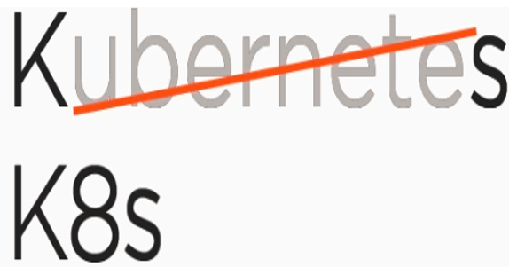
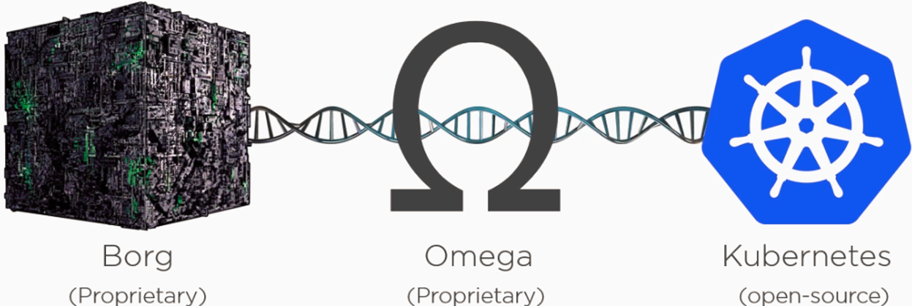
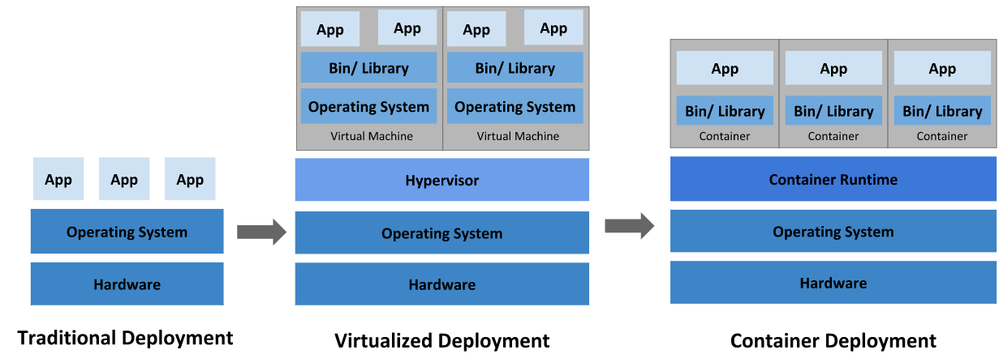
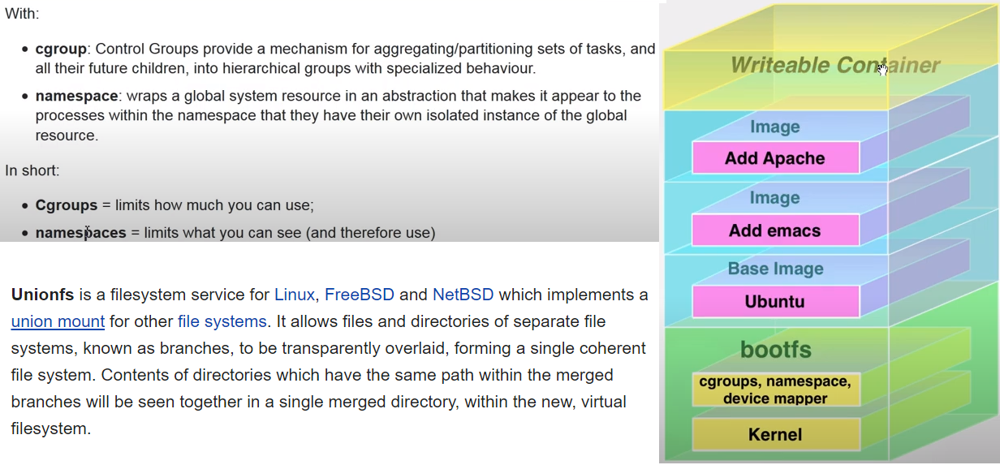
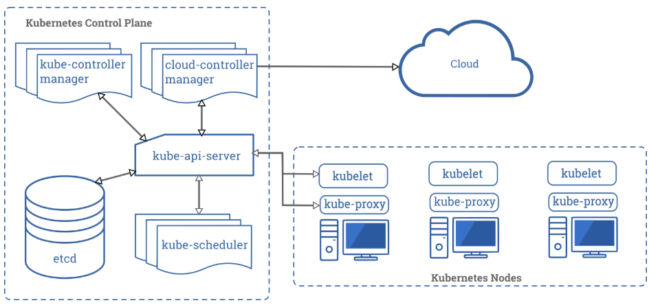
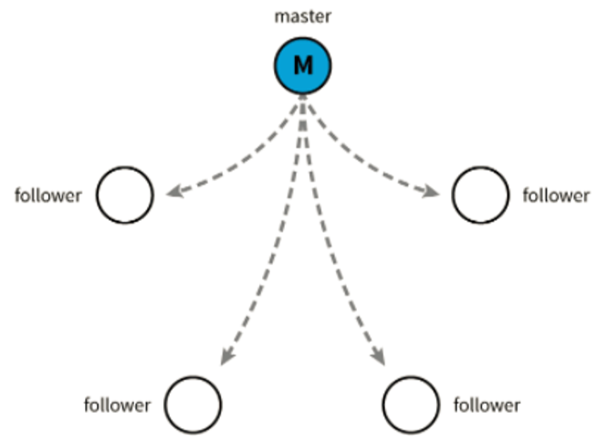
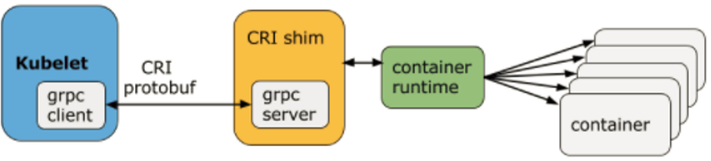

# Overview

- The name Kubernetes originates from Greek, meaning helmsman or pilot. Kubernetes is also sometimes refereed to **k8**. 

- Google open-sourced the Kubernetes project in **2014**. Kubernetes combines over 15 years of Google's experience running production workloads at scale with best-of-breed ideas and practices from the community.
- Google release v1.0 release in **July 2015** and then donated to Cloud Native Computing Foundation (CNCF). K8 has DNA of Google (Borg & Omega) and created by same people.

## Why K8
- Deploying production applications has evolved as shown in the figure below.

- Containers are similar to VMs, but they have relaxed isolation properties to share the Operating System (OS) among the applications using CGroups, Namespaces and Union File System.

- Container platform is great but we require additional tools for managing (creating, accessing, updating and deleting) containers. This process of management is called as Orchestration. K8 is a great fit for Orchestration of containers.
- K8 provide building blocks such as deployment, scaling, load balancing, and lets users integrate their logging, monitoring, and alerting solutions. These help to accelerate building developer platforms.

## Architecture
- Below are the building blocks of K8 architecture
  
- **Control Plane:** 
  - These core Kubernetes components handle the important work of making sure your containers are running in sufficient numbers and with the necessary resources. 
  - The control plane is in constant contact with your compute machines. This is used to configure your cluster to run in a certain way.

### Components:
- **Master:**
  - It is is responsible for maintaining the desired state for your cluster.
  - When you interact with Kubernetes, by using the kubectl command-line interface, you’re communicating with your cluster’s Kubernetes Master.
  - The master can also be replicated for availability and redundancy.
  - It is advisable to not run user containers on this machine
  - Each Master contains below Components.
  - **Api Server:**
    - It is the front end for the Kubernetes control plane.
    - All the administrative tasks are performed via the API server within the master node.
    - A user/operator sends REST commands to the API server, which then validates and processes the requests.
    - API Server supports OpenApi v2 specifications at [here](http://localhost:8001/openapi/v2)
    - API are categorized into three types:
      - **Alpha:**
        - The version names contain alpha (e.g. v1alpha1).
        - May be buggy. Enabling the feature may expose bugs. Disabled by default.
        - Support for feature may be dropped at any time without notice.
      - **Beta:**
        - The version names contain beta (e.g. v2beta3).
        - Code is well tested. Enabling the feature is considered safe. Enabled by default.
        - Support for the overall feature will not be dropped, though details may change.
      - **Stable:**
        - The version name is vX where X is an integer.
        - It will be available in subsequent versions.
        
  - **Etcd:**
    - Consistent and highly-available distributed key value store used as Kubernetes backing store for all cluster data like cluster specification/status, subnets, ConfigMaps, Secrets, etc.
    - It is based on **Raft Consensus Algorithm**. Raft allows a collection of machines to work as a coherent group that can survive the failures of some of its members.
    
    - At any given time, one of the nodes in the group will be the master, and the rest of them will be the followers. Any node can be treated as a master.
  - **Controller:**
    - It is the component on the master that runs controllers or non-terminating control loops. 
    - Each one of these control loops knows about the desired state of the objects it manages, and watches their current status through the API server.
    - In a control loop, if the current state of the objects it manages does not meet the desired state, then the control loop takes corrective steps to make sure that the current state is the same as the desired state.
    - Logically, each controller is a separate process, but to reduce complexity, they are all compiled into a single binary and run in a single process.
    - Examples of some controllers
      - **Node Controller:** Responsible for noticing and responding when nodes go down.
      - **Replication Controller:** Responsible for maintaining the correct number of pods for every replication controller object in the system.
      - **Endpoints Controller:** Populates the Endpoints object (that is, joins Services & Pods).
      - **Service Account & Token Controllers:** Create default accounts and API access tokens for new namespaces.
  - **Scheduler**
    -  As the name suggests, the scheduler schedules the work to different worker nodes. The scheduler has the resource usage information for each worker node.
    - It is the component on the master that watches newly created pods that have no node assigned, and selects a node for them to run on.
    - Factors taken into account for scheduling decisions include individual and collective resource requirements, hardware/software/policy constraints, affinity and anti-affinity specifications, data locality, inter-workload interference and deadlines.
    - The scheduler schedules the work in terms of Pods and Services.
- **Node:**
  - A node is a worker machine in Kubernetes, previously known as a **minion**.
  - Nodes in a cluster are the machines (VMs, physical servers, etc) that run your applications and cloud workflows.
  - The Kubernetes master controls each node; you’ll rarely interact with nodes directly.
  - A node’s status contains the following information:
    - Addresses
    - Condition
    - Capacity
    - Info
  - Each node contains below components
    - **Container Runtime:**
      - The container runtime is the software that is responsible for running containers.
      - Kubernetes supports several container runtimes: **Docker**, **containerd**, **CRI-O**, and any implementation of the Kubernetes **CRI (Container Runtime Interface)**
    - **Kubelet:** 
      - It is an agent that runs on each node in the cluster and communicates with the master node. It makes sure that containers are running in a pod. 
      - The kubelet takes a set of PodSpecs that are provided through various mechanisms and ensures that the containers described in those PodSpecs are running and healthy.  
      - The kubelet doesn’t manage containers which were not created by Kubernetes.
      - It also makes sure that the containers which are part of the Pods are healthy at all times. The kubelet connects to the container runtime using **Container Runtime Interface (CRI)**.
      
      - CRI implements two services: The **ImageService** is responsible for all the image-related operations, while the **RuntimeService** is responsible for all the Pod and container-related operations.
    - **Kube-proxy:**
      - Instead of connecting directly to Pods to access the applications, we use a logical construct called a **Service** as a connection endpoint. 
      - A Service groups related Pods and when accessed load balances to them.
      - It is the network proxy which runs on each worker node and listens to the API server for each Service endpoint creation/deletion. 
      - It is a network proxy which reflects Kubernetes networking services on each node. 
      - For each Service endpoint, kube-proxy sets up the routes so that it can reach to it.
      - It enables the Kubernetes service abstraction by maintaining network rules on the host and performing connection forwarding.