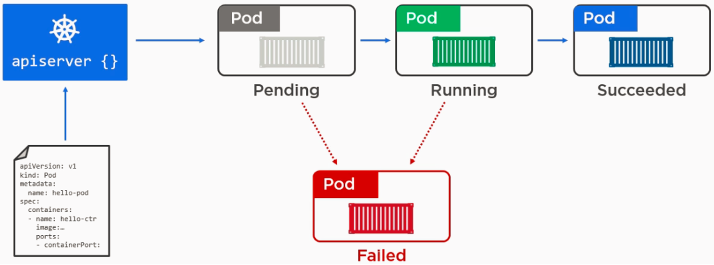

# Pod

- A Pod represents processes running on your cluster. It encapsulates an application's container storage resources, assigned a unique ID (UID), a unique network identity (IP address), as well as options that govern how the container(s) should run.
- A Pod is the basic execution unit of a Kubernetes application--the smallest and simplest unit in the Kubernetes object model that you create or deploy.
- Pods in a Kubernetes cluster can be used in two main ways:
  - **Single container:**
    - When containers in a Pod communicate with entities outside the Pod, they must coordinate how they use the shared network resources (such as ports).
  - **Multiple containers that need to work together:**
    - Containers inside a Pod can communicate with one another using localhost
- We can have multiple instances of a pod; This is called horizontal scaling or replication.
- Replicated Pods are usually created and managed as a group by **controller**.
- PodTemplates are specifications for creating Pods. Each controller for a workload resource uses the PodTemplate inside the workload object to make actual Pods.
- When a user requests deletion of a Pod, the system records the intended grace period before the Pod is allowed to be forcefully killed, and a **TERM** signal is sent to the main process in each container. 
- Once the grace period has expired, the **KILL** signal is sent to those processes, and the Pod is then deleted from the API server.
- When a force deletion is performed, the API server does not wait for confirmation from the kubelet that the Pod has been terminated on the node it was running on. 
- It removes the Pod in the API immediately so a new Pod can be created with the same name. On the node, Pods are set to  terminate immediately and a small grace period will be given before being force killed.
- Force deletions can be potentially dangerous for some Pods.   
`kubectl delete pod <XYZ> --force --grace-period=0`
- Any container in a Pod can be enabled as **privileged mode**. This is useful for containers that want to use Linux capabilities like manipulating the network stack and accessing devices. With privileged mode, it should be easier to write network and volume plugins as separate Pods
- **Phase field** is a Pod status field is a PodStatus object. The phase of a Pod is a simple, high-level summary of where the Pod is in its lifecycle. Here are the possible values for phase:


  | Phase  	| Description                                                                                                                       	|
  |----------	|----------------------------------------------------------------------------------------------------------------------------------	|
  | Pending  	| The Pod has been accepted by the Kubernetes system, but one or more of the Container images has not been created.                	|
  | Running  	| The Pod has been bound to a node, and all of the Containers have been created.                                                   	|
  | Succeeded 	| All Containers in the Pod have terminated in success, and will not be restarted.                                                 	|
  | Failed   	| All Containers in the Pod have terminated, and at least one Container has terminated in failure.                                 	|
  | Unknown  	| For some reason the state of the Pod could not be obtained, typically due to an error in communicating with the host of the Pod. 	|
- Once Pod is assigned to a node by scheduler, kubelet starts creating containers using container runtime.There are three possible states of containers
  | Status     	| Description                                                                                                                                                                                                                                                                   	|
  |------------	|------------------------------------------------------------------------------------------------------------------------------------------------------------------------------------------------------------------------------------------------------------------------------	|
  | Waiting    	| The default state of the container. If the container is not in either Running or Terminated state, it is in Waiting state. A container in Waiting state still runs its required operations, like pulling images, applying Secrets, etc.                                      	|
  | Running    	| Indicates that the container is executing without issues. The postStart hook (if any) is executed prior to the container entering a Running state.                                                                                                                           	|
  | Terminated 	| Indicates that the container completed its execution and has stopped running. A container enters into this when it has successfully completed execution or when it has failed for some reason. Before a container enters into Terminated, preStop hook (if any) is executed. 	|
- A **Probe** is a diagnostic performed periodically by the kubelet on a Container. The kubelet can optionally perform and react to three kinds of probes on running Containers
  - **livenessProbe:**
    - Indicates whether the Container is running.
    - If the liveness probe fails, the kubelet kills the Container, and the Container is subjected to its restart policy.
    -  If a Container does not provide a liveness probe, the default state is Success.
  - **readinessProbe:**
    - Indicates whether the Container is ready to service requests.
    - If the readiness probe fails, the endpoints controller removes the Pod's IP address from the endpoints of all Services that match the Pod.
    - The default state of readiness before the initial delay is Failure.
    - If a Container does not provide a readiness probe, the default state is Success.
  - **startupProbe:**
    - Indicates whether the application within the Container is started.
    - All other probes are disabled if a startup probe is provided, until it succeeds.
    - If the startup probe fails, the kubelet kills the Container, and the Container is subjected to its restart policy. 
    - If a Container does not provide a startup probe, the default state is Success.
- **Init Container** these are like regular container but run before application/main container. Below are high-level differences of init containers
  - You can specify init containers in the Pod specification alongside the containers array. A pod can have multiple init containers.
    ```yaml
    apiVersion: v1
    kind: Pod
    metadata:
    name: myapp-pod
    labels:
      app: myapp
    spec:
      containers:
      - name: myapp-container
        image: busybox:1.28
        command: ['sh', '-c', 'echo The app is running! && sleep 3600']
      initContainers:
      - name: init-myservice
        image: busybox:1.28
        command: ['sh', '-c', "until nslookup myservice.$(cat /var/run/secrets/kubernetes.io/serviceaccount/namespace).svc.cluster.local; do echo waiting for myservice; sleep 2; done"]
      - name: init-mydb
        image: busybox:1.28
        command: ['sh', '-c', "until nslookup mydb.$(cat /var/run/secrets/kubernetes.io/serviceaccount/namespace).svc.cluster.local; do echo waiting for mydb; sleep 2; done"]
    ```
  - Each init container must complete successfully before the next one starts.
  - Init containers do not support lifecycle, livenessProbe, readinessProbe, or startupProbe because they must run to completion before the Pod can be ready.
  - Init containers support all the fields and features of app containers, including resource limits, volumes, and security settings. However, the resource requests and limits for an init container are handled differently.
- A **PodPreset** is an API resource for injecting additional runtime requirements into a Pod at creation time.
- **Topology Spread Constraints** is used to control how Pods are spread across your cluster among failure-domains such as regions, zones, nodes, and other user-defined topology domains. This can help to achieve high availability as well as efficient resource utilization.
- Pods do not disappear until someone destroys them or there is an unavoidable hardware or system software error. To handle these k8 supports **PodDisruptionBudget (PDB)**. 
- A PDB limits the number of pods of a replicated application that are down simultaneously from voluntary disruptions.
- PDB cannot prevent involuntary disruptions from occurring, but they do count against the budget.