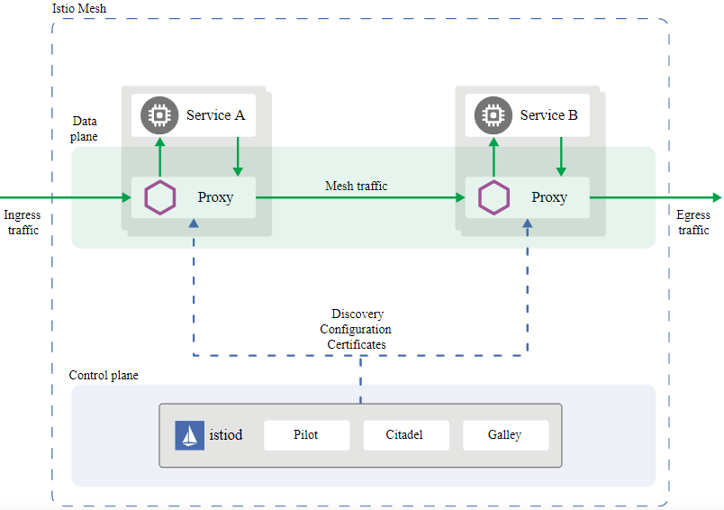
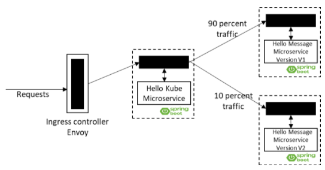

# Istio

## Overview
- The term service mesh is used to describe the network of microservices that make up such applications and the interactions between them.
- A service mesh has more complex operational requirements as below:
  - Service Discovery
  - Load Balancing
  - Failure Recovery
  - Metrics
  - Monitoring
  - A/B testing
  - Canary Releases
  - Rate Limiting
  - Access Control
  - End-to-end Authentication
- Istio provides behavioral insights and operational control over the service mesh as a whole. Its key features are given below:
  - **Traffic Management:** Control the flow of traffic and API calls between services.
  - **Observability:** Gain understanding of the dependencies between services and the nature and flow of traffic between them
  - **Policy Enforcement:** Apply organizational policy to the interaction between services.
  - **Service Identity and Security:** Provide services identity and the ability to protect service traffic as it flows over networks.
  - **Integration and Customization:** The policy enforcement component can be extended and customized to integrate with existing solutions for ACLs, logging, monitoring, quotas, auditing and more.
- Istio service mesh is logically split into
  - **Data Plane:**
    - It is composed of a set of intelligent proxies (**Envoy**) deployed as sidecars. 
    - These proxies mediate and control all network communication between microservices.
  - **Control Plane:**
    - Manages and configures the proxies to route traffic.
    - **Istiod** 
      - Provides service discovery, configuration and certificate management.
      - Istiod converts high level routing rules that control traffic behavior into Envoy-specific configurations, and propagates them to the sidecars at runtime.
        - **Pilot** provides service discovery for the Envoy sidecars, traffic management capabilities for intelligent routing (A/B tests, canary deployments), and resiliency (timeouts, retries, circuit breakers).
        - **Citadel** provides strong service-to-service and end-user authentication with built-in identity and credential management.
        - **Galley** provides configuration validation, ingestion, processing, and distribution component.
    
      

- **Istioctl** is configuration command line utility of Istio. It helps to create, list, modify and delete configuration resources in the Istio system.

## Installation
- Labs K8
  ```sh
  # Create Master
  kubeadm init --apiserver-advertise-address $(hostname -i) --pod-network-cidr 10.5.0.0/16

  # Initialize Networking
  kubectl apply -f https://raw.githubusercontent.com/cloudnativelabs/kube-router/master/daemonset/kubeadm-kuberouter.yaml

  # Create Nodes
  kubeadm join 192.168.0.23:6443 --token sqf8s3.hdtryi32bh389uzb \
    --discovery-token-ca-cert-hash sha256:9bafb85c63af4c347c666413c1253a5b4a58322280301c57ba0f41f280e8dc16

  # Check Status
  kubectl get nodes -w

  # Run Dashboard
  curl -L -s https://raw.githubusercontent.com/kubernetesdashboard/v2.0.4/aio/deploy/recommended.yaml | sed 's/targetPort: 8443targetPort: 8443\n  type: LoadBalancer/' | kubectl apply -f -
  
  # Verify Dashboard
  kubectl get pods -n kubernetes-dashboard
  kubectl get svc -n kubernetes-dashboard
  kubectl proxy --address='0.0.0.0' --accept-hosts='^*$' --port=8001
  curl -L  -s http://localhost:8001/api/v1

  # Access Dashboard
  kubectl get services kubernetes-dashboard -n kube-system
  kubectl describe serviceaccount kubernetes-dashboard -n kube-system
  kubectl describe secrets kubernetes-dashboard-token-<XX> -n kube-system
  
  # Delete Dashboard
  curl -L -s https://raw.githubusercontent.com/kubernetesdashboard/v2.0.4/aio/deploy/recommended.yaml | sed 's/targetPort: 8443targetPort: 8443\n  type: LoadBalancer/' | kubectl delete -f -

  # Run Nginx Server
  kubectl apply -f https://k8s.io/examples/controllers/nginx-deployment.yaml
  kubectl get pods -w
  kubectl get deployments
  kubectl expose deploy/nginx-deployment --port 80 --type=LoadBalancer
  kubectl get svc

  # Delete Nginx Server
  kubectl delete deployments nginx-deployment
  kubectl delete svc nginx-deployment

  # General Commands
  kubectl get pods
  kubectl run nginx --image=nginx:latest --replicas=4
  kubectl delete pods nginx
  ```

- Istio Installation Steps   
  ```sh
  # Download Software
  curl -L https://istio.io/downloadIstio | sh -
  cd istio*
  export PATH=$PWD/bin:$PATH
  echo 'export PATH=~/istio*/bin:$PATH' >> ~/.bashrc

  # Installing Istio with demo configuration profile
  istioctl x precheck
  istioctl install --set profile=demo -y
  istioctl install --set revision=<revision>

  # Upgrade Istio
  istioctl upgrade

  # Auto enable Istio on default namespace 
  kubectl label namespace default istio-injection=enabled
  kubectl get namespace -L istio-injection

  # Validate
  istioctl verify-install
  kubectl get crds
  kubectl get crds | grep 'istio.io\|certmanager.k8s.io' | wc -l
  kubectl get svc -n istio-system
  kubectl get pods -n istio-system
  ```

## Module
- Canary Release Example
  

  ```sh
  # Login to https://labs.play-with-k8s.com/
  # Spring Project flow HelloKube (docker: pmusale/istiocanary) -> HelloService (docker: pmusale/kubecanary v1,v2)
  # Below files available in MyDev Folder

  # Create Istio HelloWorld containing Deployments, Service, Gateway & VirtualService
  # curl -L -s https://raw.githubusercontent.com/rahgadda/Kubernetes/master/MyDev/helloworld.yaml | kubectl apply -f -
  kubectl apply -f helloworld.yaml -n default

  # Create istiocanary i.e HelloKube
  # curl -L -s https://raw.githubusercontent.com/rahgadda/Kubernetes/master/MyDev/kube-canary-app.yaml | kubectl apply -f -
  kubectl apply -f kube-canary-app.yaml -n default

  # Create kubecanary i.e HelloService v1 & v2
  # curl -L -s https://raw.githubusercontent.com/rahgadda/Kubernetes/master/MyDev/hello-message-app.yaml | kubectl apply -f -
  kubectl apply -f hello-message-app.yaml -n default

  # Configure Istio Gateway, VirtualService & Destination Rule
  # curl -L -s https://raw.githubusercontent.com/rahgadda/Kubernetes/master/MyDev/istio-config.yaml | kubectl apply -f -
  kubectl apply -f istio-config.yaml

  # Get SVC Details
  kubectl get svc
  kubectl get svc -n istio-system
  kubectl get svc -n istio-system -l app=istio-ingressgateway

  # Get Istio Proxy Status
  istioctl ps

  # Get Ingress Port Mapping
  export INGRESS_PORT=$(kubectl -n istio-system get service istio-ingressgateway -o jsonpath='{.spec.ports[?(@.name=="http2")].nodePort}')
  
  # Test URL curl http://$URL:$INGRESS_PORT/hello
  # Test URL curl http://$URL:$INGRESS_PORT/welcome

  # Script to print
  vi test.bash
  
  #!/bin/bash
  for i in {1..100}
  do
    echo $i `curl -s http://localhost:$INGRESS_PORT/welcome`
  done
  ```

## Reference
- [Installation](https://istio.io/latest/docs/setup/getting-started/)