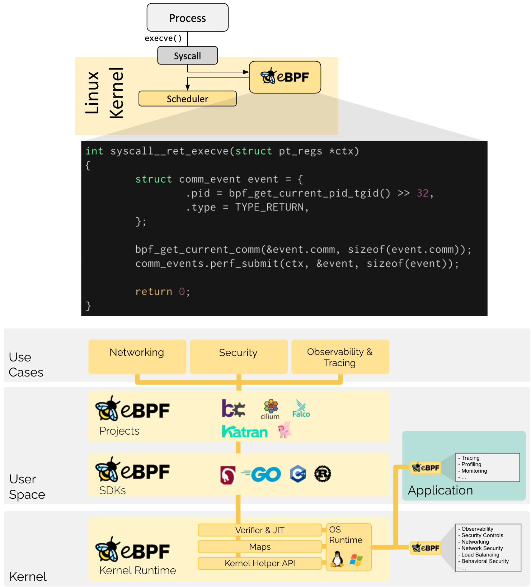

# Cilium

## Overview
- `Cilium` is `open source software` for transparently securing the `network connectivity` between application services deployed using Linux container management platforms like `Docker` and `Kubernetes`.
- At the foundation of Cilium is a new Linux kernel technology called `eBPF`, which enables the dynamic insertion of powerful security visibility and control logic within Linux itself.
- `eBPF` runs inside the `Linux kernel`, this helps Cilium security policies can be applied and updated without any changes to the application code or container configuration.
- `Hubble` is a fully `distributed networking and security observability` platform built on top of Cilium to enable deep visibility into the communication and behavior of services as well as the networking infrastructure in a completely transparent manner.

## eBPF
- `eBPF` was first created in 2014. `Cilium` was first created in 2016.
- Historically, the `operating system` has always been an ideal place to implement `observability, security, and networking functionality` due to the kernel’s privileged ability to oversee and control the entire system.
- At the same time, `an operating system kernel is hard to evolve due to its central role and high requirement towards stability and security`.
- eBPF changes this formula fundamentally by `allowing to run sandboxed programs within the operating system`, application developers can `run eBPF programs to add additional capabilities` to the operating system at runtime.
- The `operating system guarantees` safety and execution efficiency as if natively compiled with the aid of a `Just-In-Time (JIT) compiler and verification engine`. 
- eBPF programs are `event-driven` and are run when the kernel or an application passes a certain `hook point`. Pre-defined hooks include system calls, function entry/exit, kernel trace points, network events, and several others.


## Installation
- Installation Steps
```sh
kubectl get nodes
cilium install
cilium status
kubectl rollout status -n kube-system daemonset/cilium

# Example
kubectl apply -f https://raw.githubusercontent.com/cilium/cilium/HEAD/examples/minikube/http-sw-app.yaml
kubectl get pods,svc
kubectl exec tiefighter -- curl -s -XPOST deathstar.default.svc.cluster.local/v1/request-landing
kubectl exec xwing -- curl -s -XPOST deathstar.default.svc.cluster.local/v1/request-landing
kubectl apply -f https://raw.githubusercontent.com/cilium/cilium/HEAD/examples/minikube/sw_l3_l4_policy.yaml
kubectl exec tiefighter -- curl -s -XPOST deathstar.default.svc.cluster.local/v1/request-landing
kubectl exec xwing -- curl -s -XPOST deathstar.default.svc.cluster.local/v1/request-landing

spec:
  description: "L3-L4 policy to restrict deathstar access to empire ships only"
  endpointSelector:
    matchLabels:
      org: empire
      class: deathstar

  ingress:
  - fromEndpoints:
    - matchLabels:
        org: empire
    toPorts:
    - ports:
      - port: "80"
        protocol: TCP

```

## Commands
- Command to review Kubernetes Pod Networking. List all IP Tables for KUBE-SERVICE and review IP Tables for each service. 
    ```sh
    sudo iptables -n -t nat - L KUBE-SERVICE
    sudo iptables -n -t nat - L KUBE-SERVICE-XXXXX
    ```


# Reference
- [Official Documentation](https://docs.cilium.io/en/stable/gettingstarted/)
- [eBPF](https://ebpf.io/)
- [Video 1](https://www.youtube.com/watch?v=aLq3O3l2LF4), [Video 2](https://www.youtube.com/watch?v=5EcVrm01rAU), [Video 3](https://www.youtube.com/watch?v=gkrPt0ZcCfo)