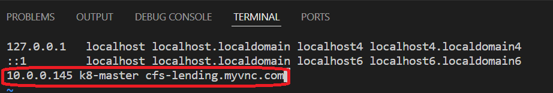

# Kubernetes Installation - On Master

### Launching Terminal
- [Open Terminal](didact://?commandId=vscode.didact.startTerminalWithName&text=K8MasterInstall)
- [Login to Root](didact://?commandId=vscode.didact.sendNamedTerminalAString&text=K8MasterInstall$$sudo%20su)

### Add K8 Master and Nodes public ip details
- [Create hosts](didact://?commandId=vscode.didact.sendNamedTerminalAString&text=K8MasterInstall$$vi%20%2Fetc%2Fhosts)

- [Verification](didact://?commandId=vscode.didact.sendNamedTerminalAString&text=K8MasterInstall$$ping%20cfs-lending.myvnc.com)

### Firewall Configuration
- [Move Folder](didact://?commandId=vscode.didact.sendNamedTerminalAString&text=K8MasterInstall$$cd%20%2Fhome%2Fopc%2FK8%2F01-Install)
- [Update Firewall Details](didact://?commandId=vscode.didact.sendNamedTerminalAString&text=K8MasterInstall$$source%20firewallConsif.sh)

### Docker Installation
- [Install Container Runtime](didact://?commandId=vscode.didact.sendNamedTerminalAString&text=K8MasterInstall$$source%20dockerInstallation.sh)

### Kubernetes Installation
- [K8 Installation](didact://?commandId=vscode.didact.sendNamedTerminalAString&text=K8MasterInstall$$source%20k8Install.sh)
- [K8 Helm](didact://?commandId=vscode.didact.sendNamedTerminalAString&text=K8MasterInstall$$source%20k8Helm.sh)
- [K8 Nginx Ingress](didact://?commandId=vscode.didact.sendNamedTerminalAString&text=K8MasterInstall$$source%20k8Ingress.sh)
- [K8 Dashboard](didact://?commandId=vscode.didact.sendNamedTerminalAString&text=K8MasterInstall$$source%20k8Dashboard.sh)
- [K8 Certificate Manager](didact://?commandId=vscode.didact.sendNamedTerminalAString&text=K8MasterInstall$$source%20k8Certificate.sh)
- [Exit Terminal](didact://?commandId=vscode.didact.sendNamedTerminalAString&text=K8MasterInstall$$exit)

### Delete Kubernetes
- [K8 Master Uninstallation](didact://?commandId=vscode.didact.sendNamedTerminalAString&text=K8MasterInstall$$source%20k8Uninstall.sh)

## Additional
- [Install Telnet](didact://?commandId=vscode.didact.sendNamedTerminalAString&text=K8MasterInstall$$yum%20install%20-y%20telnet)
- [Unistall MySql](didact://?commandId=vscode.didact.sendNamedTerminalAString&text=K8MasterInstall$$sudo%20yum%20remove%20mysql%20mysql-server%20-y)